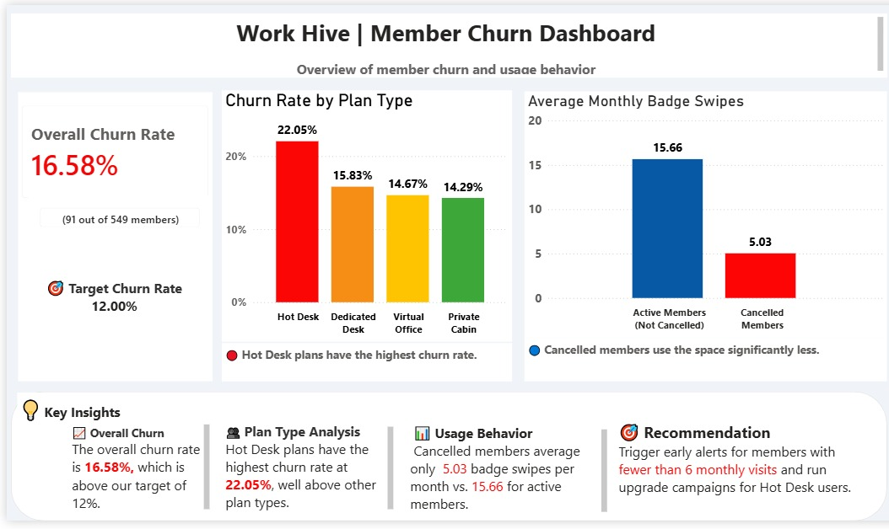

# WorkHive | Member Churn Analytics Dashboard

## Project Overview

WorkHive, a coworking space operator, was experiencing member cancellations above their target threshold. This project analyzes **549 member records** to identify churn patterns, high-risk membership segments, and engagement gaps — and delivers a dashboard with actionable retention recommendations.

---

## Business Problem

WorkHive's overall **churn rate stood at 16.58%** (91 out of 549 members), well above their **12% target**. Leadership needed clarity on:

- Which membership plans were driving the highest churn
- How engagement behavior differed between active and cancelled members
- What early warning signals could predict churn before it happens

---

## Dashboard Preview

 
---

## Key Insights

### 📊 Overall Churn Summary
| Metric | Value |
|---|---|
| Total Members | 549 |
| Churned Members | 91 |
| Overall Churn Rate | 16.58% |
| Target Churn Rate | 12.00% |

Churn is **4.58 percentage points above target** — a clear signal of retention issues.

### 📋 Churn Rate by Plan Type
| Plan Type | Churn Rate |
|---|---|
| Hot Desk | 22.05% ❌ Highest |
| Dedicated Desk | 15.83% |
| Virtual Office | 14.67% |
| Private Cabin | 14.29% ✅ Lowest |

Hot Desk plans churn at **22.05%** — significantly higher than all other plan types and the primary driver of overall churn.

### 🏃 Usage Behavior — Badge Swipes per Month
| Member Status | Avg Monthly Badge Swipes |
|---|---|
| Active Members | 15.66 |
| Cancelled Members | 5.03 |

Cancelled members use the space **3x less** than active members before churning — making badge swipe frequency a reliable early warning signal.

### 🎯 Strategic Recommendations
- Trigger early retention alerts for members with **fewer than 6 badge swipes per month**
- Launch targeted **upgrade campaigns for Hot Desk users** to move them to Dedicated Desk plans
- Implement proactive outreach before members hit low-engagement thresholds
- Monitor plan-level churn monthly to catch spikes early

---

## Tools & Technologies
`SQL` `Power BI` `Data Visualization` `KPI Reporting` `Business Intelligence`

---

## Dataset
Member records including membership plan type, cancellation status, badge swipe frequency, and engagement metrics across 549 WorkHive members.

---

## Files Included

| File | Description |
|---|---|
| workhive_churn.csv | Source Dataset |
| workhive_churn_data.sql | SQL Analysis Script |
| workhive_dashboard.pbix | Power BI Dashboard *(coming soon)* |
| dashboard_preview.jpeg | Dashboard Screenshot *(coming soon)* |

---

## Author
**Harshitha S** — Aspiring Data Analyst
[LinkedIn](https://www.linkedin.com/in/harshitha-s-167639256) | [GitHub](https://github.com/Harsh-itha2001)
